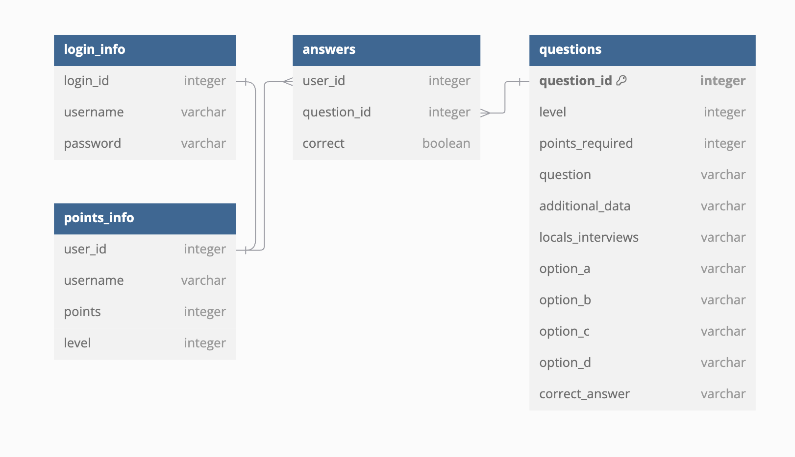

Agile methodologies & version control
UX Design principles
Frontend Development (HTML,CSS,JavaScript)
Backend Development (Express, Node.js)
MVC architecture
Databases
Brief
Overview

Deliverables

Stakeholder & solutions analysis

Mitigation Strategies for Risks
**1. Technical Risks**
* **Bugs & Technical Failures**
  * *Mitigation:* Implement thorough testing (unit, integration, and end-to-end tests), use monitoring tools, and set up automated backups.
* **Poor Frontend-Backend Integration**
  * *Mitigation:* Define clear API contracts, use Postman for testing API endpoints, and conduct regular team syncs.
* **Security Vulnerabilities in Login/Signup System**
  * *Mitigation:* Implement proper authentication (e.g., JWT, OAuth), encrypt sensitive data, and conduct security audits.

⠀**2. Project Management Risks**
* **Team Communication Breakdown**
  * *Mitigation:* Use Agile stand-ups, Trello for task tracking, and GitHub issues for collaboration.
* **Project Delays Due to Scope Creep**
  * *Mitigation:* Define MVP clearly, set feature freeze deadlines, and prioritize core functionalities.
* **Version Control Conflicts in GitHub**
  * *Mitigation:* Use branching strategies (feature branches, pull requests, and code reviews), and conduct Git training.

⠀**3. User Engagement & Adoption Risks**
* **Students Find the Game Boring**
  * *Mitigation:* Conduct user testing, gather feedback from students, and implement gamification elements (badges, leaderboards).
* **Teachers Struggle with Implementation**
  * *Mitigation:* Provide onboarding tutorials, teacher-friendly dashboards, and integration with lesson plans.
* **Parents Don’t See the Value**
  * *Mitigation:* Share impact reports, testimonials, and provide easy-to-understand resources on the benefits of the tool.

⠀**4. Compliance & External Risks**
* **Failing to Meet Department for Education Guidelines**
  * *Mitigation:* Regularly review and align with educational standards, consult educators, and iterate based on feedback.
* **Data Privacy Concerns (GDPR Compliance)**
  * *Mitigation:* Use secure data storage, minimize data collection, provide clear privacy policies, and allow users to manage their data.

To address the fun element we will create an adventure game. Within the game there will be multiple choice questions. For each question the user will be able to click on a button to get clues(in picture format) about the correct answer and will also be able to click a button to “ask the locals” (in text format), this will reveal another clue to the correct answer. These will address variety and allow students to work on their critical thinking. To improve engagement we are also adding Levels to the game and points for each question answered correctly. Once the mvp is up and running we aim at adding a feature that allows teacher to see the students scores.

High level solution diagram

Database schema diagram

Wireframes

Functional, deployed, MVP of your proposed solution

Presentation

/////////////////////////

Project Planning:

Develop a clear project plan outlining objectives, scope, timelines, and resource requirements.
Identify and define project tasks, activities, and dependencies.
Create a realistic project schedule.
Allocate resources appropriately based on project requirements.
Team Leadership:

Build and lead a cohesive project team.
Foster a positive team culture and maintain motivation.
Clearly communicate roles and responsibilities to team members.
Communication:

Act as a liaison between team members & trainers.
Facilitate effective communication within the team.
Provide regular project status updates.
Risk Management:

Proactively address and manage issues as they arise during the project.
Scope Management:

Clearly define project scope and ensure that it remains within defined boundaries.
Manage changes to the project scope and assess their impact.
Timeline Management:

Monitor project timelines and milestones.
Identify potential delays and implement strategies to keep the project on track.
Documentation:

Maintain comprehensive project documentation, including project plans & and other relevant resources.
Ensure all project documentation is up-to-date and easily accessible (Github & Trello Board)

////////////////////////

Problem Statement

The management team of the Hive group of secondary schools has noticed a lack of engagement in non-STEM subjects over the last two years. They would like to try and reverse this trend and have asked an external team to come up with a solution that places student enjoyment at the heart of the learning experience.

Background Research
Chief Executive Officer, Hive Foundation

”Whilst we understand that a comprehensive grasp of STEM subjects is increasingly important within a rapidly technologising society, we also believe all students need a well-rounded, holistic education so that they are able to explore subjects with confidence, retain key knowledge, and obtain high level skills such as critical thinking.”

Students

”Sometimes certain subjects rely on textbook work too much and this means that the lessons can feel the same.”

“I love learning about different topics but it feels like we have so many things to cover that I struggle to remember it all.”

“Lessons can often feel the same with teachers using the same activities repeatedly.”

Parents

”It’s hard to know what to focus on as a parent. Students seem to be overwhelmed with content and this leads to a lack of enjoyment.”

“It feels like a lot of fun is missing from the curriculum at the moment, my child used to love school but this seems to be changing.”

Teachers

“As things stand, a greater focus on STEM subjects has meant that there is less time available for us to spend on non-core subjects in particular. A result of this is that knowledge that students gain is often superficial and lacks depth.”

“With the frequency of lessons decreasing, one of the things that we are increasingly noticing is that students are struggling to retain the knowledge that they need.”

Department for Education Guidance

See current guidance here (section 7.1).

Technical Guidelines
Use version control & work in an Agile manner!
Your repos should have excellent READMEs. See our Writing READMEs guide for details.
Your repos should be hosted on Github and your team should utilise it to collaborate with each other. Please refer to the Git/Github flow document to help with your process
Your work should make good use of the concepts we have covered so far on the course such as wireframes, working methodologies, architectural thinking, logical reasoning, and authorisation principles.
Your MVP should make good use of the technologies we have covered so far on the course such as HTML, CSS, JavaScript, Express API, Node, SQL and version control tools.
You must utilise a database.
Your project will need a frontend and a backend connected to the database.
A signup/login system should be implemented.
Your app should be deployed and you should aim for test coverage of at least 60%.
Supporting end-user documentation
Make sure to create a project README for both the backend & frontend
Examples to consider including in your READMEs but are not limited to:
Style guide
API documentation
Getting Started guide
Presentation Requirements
Prepare a 10 minute presentation covering the following topics (this is the order we'd like you to follow):

Meet the Team (include photos)
Purpose of Solution
Planning & Delivery (trello board, wireframes, ERD, stakeholder analysis..)
Live Demonstration: you will need to make a screen recording of your product UI and one person from your team will be talking over the recording during the presentation
Technologies
Significant Code / Code you are proud of (include snippets!)
Test Coverage
Challenges and Solutions
Future Features
What We've Learned
There will be a 5 minute opportunity for Q&A after each presentation.

Project logistics
Timeline
Time
Team
Standups & Retros
Each team will have:

A daily stand-up (except weekend)
Soundchecks
Timeline touchpoints
Project management requirements
If you have been assigned a PM role for this project, please find what your responsibilities entail below.

IMPORTANT NOTE: While you are in charge of the smooth planning & delivery of the project, we expect you to participate to the technical development of the project as well.

