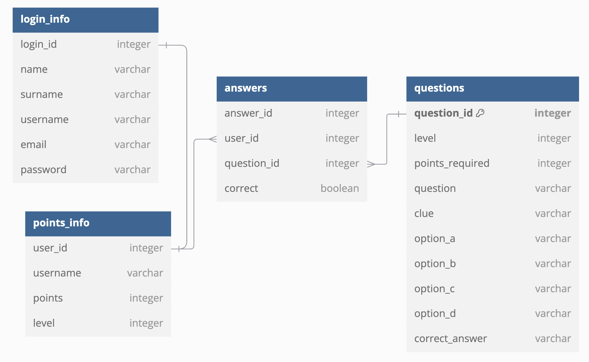

# Problem Statement

- The management team of the Hive group of secondary schools has noticed a lack of engagement in non-STEM subjects over the last two years. They would like to try and reverse this trend and have asked an external team to come up with a solution that places student enjoyment at the heart of the learning experience.

# Background Research
- Chief Executive Officer, Hive Foundation

- ”Whilst we understand that a comprehensive grasp of STEM subjects is increasingly important within a rapidly technologising society, we also believe all students need a well-rounded, holistic education so that they are able to explore subjects with confidence, retain key knowledge, and obtain high level skills such as critical thinking.”

# Students

- ”Sometimes certain subjects rely on textbook work too much and this means that the lessons can feel the same.”

- “I love learning about different topics but it feels like we have so many things to cover that I struggle to remember it all.”

- “Lessons can often feel the same with teachers using the same activities repeatedly.”

# Parents

- ”It’s hard to know what to focus on as a parent. Students seem to be overwhelmed with content and this leads to a lack of enjoyment.”

- “It feels like a lot of fun is missing from the curriculum at the moment, my child used to love school but this seems to be changing.”

# Teachers

- “As things stand, a greater focus on STEM subjects has meant that there is less time available for us to spend on non-core subjects in particular. A result of this is that knowledge that students gain is often superficial and lacks depth.”

- “With the frequency of lessons decreasing, one of the things that we are increasingly noticing is that students are struggling to retain the knowledge that they need.”

# Stakeholder Analysis

# Risk Analysis

# Mitigation Strategies for Risks

## 1. Technical Risks
- ### Bugs & Technical Failures
  - Mitigation: Implement thorough testing (unit, integration, and end-to-end tests), use monitoring tools, and set up automated backups.
- ### Poor Frontend-Backend Integration
  - Mitigation:Define clear API contracts, use Postman for testing API endpoints, and conduct regular team syncs.
- ### Security Vulnerabilities in Login/Signup System
  - Mitigation: Implement proper authentication (e.g., JWT, OAuth), encrypt sensitive data, and conduct security audits.

## 2. Project Management Risks
- ### Team Communication Breakdown
  - Mitigation: Use Agile stand-ups, Trello for task tracking, and GitHub issues for collaboration.
- ### Project Delays Due to Scope Creep**
  - Mitigation: Define MVP clearly, set feature freeze deadlines, and prioritize core functionalities.
- ### Version Control Conflicts in GitHub
  - Mitigation: Use branching strategies (feature branches, pull requests, and code reviews), and conduct Git training.

## 3. User Engagement & Adoption Risks
- ### Students Find the Game Boring
  - Mitigation: Conduct user testing, gather feedback from students, and implement gamification elements (badges, leaderboards).
- ### Teachers Struggle with Implementation
  - Mitigation: Provide onboarding tutorials, teacher-friendly dashboards, and integration with lesson plans.
- ### Parents Don’t See the Value
  - Mitigation: Share impact reports, testimonials, and provide easy-to-understand resources on the benefits of the tool.

## 4. Compliance & External Risks
- ### Failing to Meet Department for Education Guidelines
  - Mitigation: Regularly review and align with educational standards, consult educators, and iterate based on feedback.
- ### Data Privacy Concerns (GDPR Compliance)
  - Mitigation: Use secure data storage, minimize data collection, provide clear privacy policies, and allow users to manage their data.

# Solution analysis  

- To address the fun element we will create a mystery game. Within the game there will be multiple choice questions. For each question the user will be able to click on a button that gives them clues about the correct answer to the final mystery. These will address variety, and allow students to work on their critical thinking. To improve engagement we are also adding Levels to the game and in the future we'd like to add points for each question answered correctly. Once the mvp is up and running we aim at adding a feature that allows the teacher to see the students scores.

# High level solution diagram

# Database schema diagram

# Wireframe

